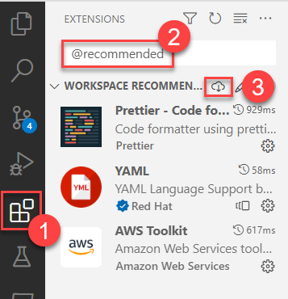
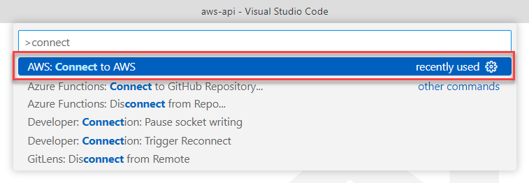
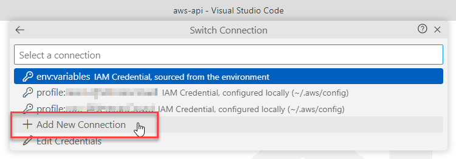
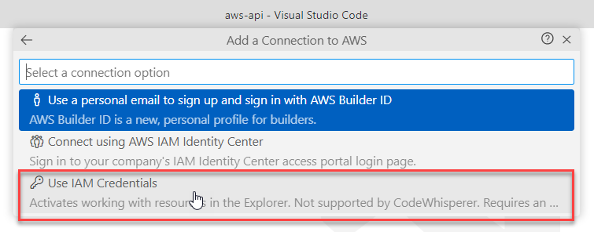
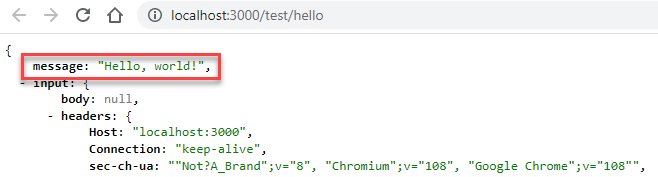

# aws-api

This is the VeteranCrowd Amazon Web Services (AWS) API.

# Setting Up Your Dev Environment

All developers MUST use the Visual Studio Code IDE in order to leverage relevant extensions.

These instructions are written from the perspective of the Windows OS. If you are a Mac user, you may need to make some adjustments.

They also assume you have local administrator permissions on your development machine.

## Install Applications & Global Packages

AWS-API is implemented in [Node.js](https://nodejs.org/en/). Node.js is now in `v19`, but the latest AWS Lambda Function Node.js execution environment is `v18`. The current Node.js LTS version is `v18.12.1`, so we'll use that one.

Rather than install Node.js directly, it is better to install it & manage versions from the the Node Version Manager (NVM). Follow these instructions to configure your system:

1. If you already have Node.js installed on your machine, uninstall it completely and remove all installation. You can easily use NVM to reinstall & switch between other desired Node versions.

1. Follow [these instructions](https://www.freecodecamp.org/news/node-version-manager-nvm-install-guide/) to install NVM on your system.

1. Once NVM is installed on your system, open a terminal with **System Admin Permissions** and run the following commands:

   ```bash
   # windows only
   Set-ExecutionPolicy -ExecutionPolicy Unrestricted -Scope CurrentUser -Force

   # all platforms
   nvm install 18.12.1
   nvm use 18.12.1
   npm install -g serverless
   ```

1. Install Git for your operating system from [this page](https://git-scm.com/download).

1. Install Visual Studio Code from [this page](https://code.visualstudio.com/).

1. **WINDOWS ONLY:** Open VS Code. In a terminal window, enter `code $profile`. A file named `Microsoft.PowerShell_profile.ps1` will open in your code editor. Add the following line to this file, then save and close it:

   ```bash
   Remove-Item alias:sls
   ```

1. RESTART YOUR MACHINE!

## Clone the Project Repository

Navigate your terminal to the directory you use for code repositories and run this command to clone this repo. You may be asked to log into GitHub. Note that you must be an authorized contributor to this repo in order to clone it. Note that this command clones the `dev` branch, which is the development trunk. This repo will not accept direct commits to the `main` branch.

```bash
git clone -b dev https://github.com/VeteranCrowd/aws-api.git
```

Open the newly created repo folder in VS Code.

If this is your first time opening the folder, you will be asked to install recommended VS Code extensions. Install them. If not, follow these steps to install all workspace-recommended extensions:

1. Open the VS Code Extensions tab
2. Enter `@recommended` into the search box
3. Click the Download link.

   

Run the following command to install project dependencies:

```bash
npm install
```

## Connect to AWS

You will need to connect to AWS in order to interact with AWS resources during development.

You should be in receipt of a CSV file containing your AWS access keys. It will contain data in this form:

| Access key ID | Secret access key |
| ------------- | ----------------- |
| AKI...M74     | gnG...v5f         |

Follow these steps to connect to AWS:

1. Within VS Code, type `Ctrl-Shift-P` (Windows/Linux) or `Shift-Cmd-P` (Mac) to bring up the command pallette and search for the `Connect to AWS` command.

   

1. Either choose an existing connection or create a new one with the `Add New Connection` option.

   

1. Choose `Use IAM Credentials`, give the connection profile a unique name `<profile_name>`, and enter the Access Key ID and Secret Access Key from the CSV file referenced above.

   

1. Run the following command in the VS Code terminal:

   ```bash
   aws configure set region us-east-1 --profile <profile_name>
   ```

## Test Your Setup

Enter the following command in a terminal window:

```bash
sls offline
```

A local server should start with an endpoint at [`http://localhost:3000/test/hello`](http://localhost:3000/test/hello). If you navigate to this endpoint in a browser, you should see a blob of JSON beginning with the message `Hello, world!`



# Building From Scratch

This will usually not be necessary, since AWS resources should already be in place.

To generate all AWS resources from scratch, follow these steps:

1. Request & validate a certificate from the [ACM Console](https://us-east-1.console.aws.amazon.com/acm/home#/certificates/list) that covers domains `veterancrowd.com` and `*.veterancrowd.com`. Copy the certificate ARN and paste it into `serverless.yml` at `custom.certificateArn`.

1. Run the following command to create an API Gateway custom domain at `api.veterancrowd.com`.

   ```bash
   sls create_domain --aws-profile <profile name>
   ```

1. Run the following command to deploy to the `dev` stack:

   ```bash
   sls deploy --aws-profile <profile name>
   ```

1. If the `dev` stack deployment succeeds, run the following commands to deploy to the `test` & `prod` stacks:

   ```bash
   sls deploy -s test --aws-profile <profile name>
   sls deploy -s prod --aws-profile <profile name>
   ```

# Deleting a Stack

Deleting a CloudFormation stack allows for a clean deployment of all stack resources to AWS.

> **Use with extreme caution!** Stack deletion will also eliminate all users from the related user pool!

To delete a stack, follow these instructions:

1.  Find the API domain at [API Gateway Custom Domains](https://us-east-1.console.aws.amazon.com/apigateway/main/publish/domain-names). Delete all API mappings related to the stack.

1.  Find the stack in the [CloudFormation console](https://console.aws.amazon.com/cloudformation) and click through to the stack detail.

1.  Under the Resources tab, find any S3 Buckets and delete their contents.

1.  Delete the stack.

# DevOps

This project's code repository features two protected branches: `main` and `test`. Commits to these branches trigger build processes that update public endpoints. They are configured as follows:

| Branch | Description         | Rules                                                 |                                                   Pipeline                                                    | Public Endpoint                      |
| ------ | ------------------- | ----------------------------------------------------- | :-----------------------------------------------------------------------------------------------------------: | ------------------------------------ |
| `dev`  | development trunk   | Direct commits & pull requests allowed.               |                                                     none                                                      | https://api.veterancrowd.com/v0-dev  |
| `test` | integration testing | No direct commits.<br>Pull requests only from `dev`.  | [#](https://us-east-1.console.aws.amazon.com/codesuite/codepipeline/pipelines/aws-api-codepipeline-test/view) | https://api.veterancrowd.com/v0-test |
| `main` | production          | No direct commits.<br>Pull requests only from `test`. | [#](https://us-east-1.console.aws.amazon.com/codesuite/codepipeline/pipelines/aws-api-codepipeline-prod/view) | https://api.veterancrowd.com/v0      |

To develop a feature, follow these steps:

1. Either work in `dev` or spawn a `dev-xyx` branch from `dev`. Test your work for deployment by running the following command to deploy to the `dev` stack at AWS:

   ```bash
   sls deploy --aws-profile <profile name>
   ```

1. Once `dev` deployment succeeds, merge your work into the `dev` trunk if necessary and validate deployment again from there. Then generate a pull request to merge your work with `test`.

   - If the resulting build process succeeds, the new feature will be visible at the integration testing endpoint.
   - If the build fails, report the bug & restart. The priorities should be to surface the build failure into the test build, then to resolve it.

1. Perform integration testing. If it fails, report the bug & restart.

1. Once integration testing succeeds, generate a pull request to merge your work with `main`. The new feature will be visible at the production endpoint.

# Authentication

User authentication is provided by AWS Cognito.

The setup supports sign up & sign in via the Cognito hosted UI.

Users can sign up with an email/password combination. AWS will send an email with a code to confirm the email.

Users can also sign up with the Google federated identity provider. AWS will not confirm related emails.

## Add a new federated identity provider.

TODO

## Notes

As of now, users can create multiple accounts with the same email, but different user names. Need to fix this.

Federated identities (i.e. social logins) with the same email also generate new accounts. Might be harder to fix.

[This page](https://docs.aws.amazon.com/cognito/latest/developerguide/cognito-user-pools-social-idp.html) contains instructions for setting up Cognito-compatible OAUTH2 apps at Facebook, Amazon, Google, and Apple.

It is also possible to set up custom OpenId Connect (OIDC) providers which presumably will account for Twitter etc. Haven't completely figured that one out yet but there is an AWS reference [here](https://docs.aws.amazon.com/cognito/latest/developerguide/cognito-user-pools-oidc-idp.html).

Once an OIDC provider is set up, it can be integrated via the `SupportedIdentityProviders` property described [here](https://docs.aws.amazon.com/AWSCloudFormation/latest/UserGuide/aws-resource-cognito-userpoolclient.html). See [here](https://docs.aws.amazon.com/AWSCloudFormation/latest/UserGuide/aws-resource-cognito-userpoolidentityprovider.html) for more info on defining identity providers.

I am building in an [AWS Cognito User Pool](https://docs.aws.amazon.com/cognito/latest/developerguide/cognito-user-identity-pools.html).

[This](https://medium.com/@Da_vidgf/using-cognito-for-users-management-in-your-serverless-application-1695fec9e225) looks like a solid reference, but it's a few years old (2019-02-16).

Here is a [Serverless Framework plugin](https://www.serverless.com/plugins/aws-cognito-idp-userpool-domain) that seems to do the same thing. Last update was 4 years ago.

[This](https://www.freecodecamp.org/news/aws-cognito-authentication-with-serverless-and-nodejs/) is a guide from Jan 2022.

So far we have the Cognito hosted UI functioning with user/password & Google login. A major issue right now is that a Google account with the same email as a user/password acct creates a duplicate account. Not sure what to do about that.

The hosted UI creates calls the callback URL on login. This is the first half of the OAUTH2 flow, with a code in the query string. Some questions here:

- How do I convert that code into an authorization token? There seems to be a sort of an answer [here](https://stackoverflow.com/questions/45785898/how-to-use-the-code-returned-from-cognito-to-get-aws-credentials).

- Once I have the token, is there a way to persist that in the browser so I don't have to go get it every time? The answer appears to be: _not automatically_. A web app will do this with a cookie

# API Endpoints

TODO

# Issues

## Secure Certificate

Normally we would specify a certificate on `veterancrowd.com` and `*.veterancrowd.com` using the [`serverless-certificate-creator`](https://www.serverless.com/plugins/serverless-certificate-creator) plugin. The required entry in `serverless.yaml` would look like

```yaml
custom:
  customCertificate:
    certificateName: 'veterancrowd.com'
    hostedZoneNames: 'veterancrowd.com.'
    subjectAlternativeNames:
      - '*.veterancrowd.com'
```

The alternative name is currently creating an issue with this. It looks like the plugin is trying to submit duplicate validation records to the zone file, resulting in an error. The issue is documented in [this pull request](https://github.com/schwamster/serverless-certificate-creator/pull/55).

Meanwhile, let's create & verify the certificate manually using the [ACM Console](https://us-east-1.console.aws.amazon.com/acm/home#/certificates/list) and then reference the certificate by ARN in `serverless.yaml`.
