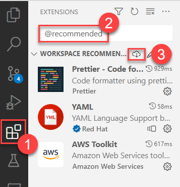

# AWS API Template

> **I am updating this README!** For now, these instructions are in a bit of an inconsistent state. Should be good to go in a few days!

This template produces a secure [Amazon Web Services](https://aws.amazon.com/) (AWS) API using the [Serverless Framework](https://www.serverless.com/).

The API features both public and private endpoints, and is secured by a Cognito User Pool that supports native username/password authentication and one federated identity provider (Google). It is configured to act as both the authentication provider and a secure remote API for my [Next.js Template](https://github.com/karmaniverous/nextjs-template) on the front end.

This template can be deployed directly from the command line to multiple [AWS CloudFormation](https://aws.amazon.com/cloudformation/) stacks, each exposing an independent environment (e.g. `dev`, `test`, and `prod`), with its own authentication provider, at configurable endpoints. These endpoints will integrate with matching Next.js Template environments.

If you integrate your code repository with [AWS CodePipeline](https://aws.amazon.com/codepipeline/), your code will automatically build and deploy following every push to the relevant branch. See [Automated Deployment](#automated-deployment) below for more info.

This template is in fact hooked into CodePipeline to support deployments to demo environments. Consequently you will see many references to the `karmanivero.us` domain. Obviously, you'll need to replace these with references to your own domain.

# The Stack

This template represents a specific solution to a bunch of specific problems. It makes a number of highly opinionated choices. Here are some of them:

## Node.js & ES6

[TODO]

## The Serverless Framework

There are many different ways to script the creation of AWS resources.

The [AWS CLI](https://aws.amazon.com/cli/) is the gold standard. It's maximally powerful, but very low level. It's probably smarter than I am.

[AWS Amplify](https://aws.amazon.com/amplify/) is new, super powerful, and supported by a great UI. It's also very HIGH-level and doesn't yet enjoy broad community support.

The [Serverless Framework](https://www.serverless.com/) is a well-supported, open-source wrapper over the AWS CLI. It is opinionated with respect to best practices, offers a ton of plugins, and is accessible to the talented amateur, of which I am one.

There are other choices as well, but we're using the Serverless Framework here because it seemed like a reasonably safe choice that offers plenty of room to grow.

## Project Configuration

As mentioned above, this template is intended to deploy to multiple environments in a highly configurable fashion. Both the project as a whole and individual environments include _secrets_: configurations that need to exist in your dev environment to support local testing and manual deployment, but should NOT be pushed to your code repository.

The key AWS configuration file in the project is `serverless.yml`. Nominally this file would contain most of this stuff, but I thought it would be a good idea to abstract configuration data away from this highly structured file.

Everybody understands `.env` environment variable files, so that seemed to be a great way to go, which is nominally supported by the [Serverless Dotenv Plugin](https://www.serverless.com/plugins/serverless-dotenv-plugin). Unfortunately, I couldn't get it to work.

So I eliminated this dependency and am relying instead on the very robust [`dotenv-cli`](https://www.npmjs.com/package/dotenv-cli) tool, which does everything the plugin promises and works like a charm.

Because of this, you will almost NEVER run `sls` directly! Instead, you will preface it with `dotenv` and your target environment, like this:

```bash
dotenv -c dev -- sls deploy
```

More info on this in the relevant sections below.

## Release Management

[TODO]

# Setting Up Your Dev Environment

Use the [Visual Studio Code](https://code.visualstudio.com/) IDE in order to leverage relevant extensions. Not an absolute requirement but you'll be happy if you do.

These instructions are written from the perspective of the Windows OS. If you are a Mac user, you may need to make some adjustments.

They also assume you have local administrator permissions on your development machine.

## Install Applications & Global Packages

This template is a [Node.js](https://nodejs.org/en/) project. Node.js is now in `v19`, but the latest [AWS Lambda](https://aws.amazon.com/lambda/) Node.js execution environment is `v18`. The current Node.js LTS version is `v18.12.1`, so we'll use that one.

Rather than install Node.js directly, it is better to install it & manage versions from the the Node Version Manager (NVM). Follow these instructions to configure your system:

1. If you already have Node.js installed on your machine, uninstall it completely and remove all installation files. You can easily use NVM to reinstall & switch between other desired Node versions.

1. Follow [these instructions](https://www.freecodecamp.org/news/node-version-manager-nvm-install-guide/) to install NVM on your system. **This is a Windows-specific implementation!** Mac/Linux users, adjust accordingly.

1. Once NVM is installed on your system, open a terminal with **System Admin Permissions** and run the following commands:

   ```bash
   # windows only
   Set-ExecutionPolicy -ExecutionPolicy Unrestricted -Scope CurrentUser -Force

   # all platforms
   nvm install 18.12.1
   nvm use 18.12.1
   npm install -g serverless dotenv-cli
   ```

1. Install Git for your operating system from [this page](https://git-scm.com/download).

1. Install Visual Studio Code from [this page](https://code.visualstudio.com/).

1. **WINDOWS ONLY:** Open VS Code. In a terminal window, enter `code $profile`. A file named `Microsoft.PowerShell_profile.ps1` will open in your code editor. Add the following line to this file, then save and close it:

   ```bash
   Remove-Item alias:sls
   ```

1. **Restart your machine.**

## Create a new GitHub Repository

[Click here](https://github.com/karmaniverous/aws-api-template/generate) to clone this template into your own GitHub account. Give it a name like `my-aws-api`.

**Are you cloning an existing repository?** No need to do this then.

## Clone the Project Repository

Navigate your VS Code terminal to the directory you use for code repositories and run this command to clone this repo, using your new project name. You may be asked to log into GitHub.

```bash
git clone https://github.com/karmaniverous/my-aws-api.git
```

Open the newly created local repository folder in VS Code.

If this is your first time opening the folder, you will be asked to install recommended VS Code extensions. Install them. If not, follow these steps to install all workspace-recommended extensions:

1. Open the VS Code Extensions tab
2. Enter `@recommended` into the search box
3. Click the Download link.

   

Run the following command to install project dependencies:

```bash
npm install
```

## Create Local Environmental Variable Files

Look for these files in your project directory:

- `.env.local.template`
- `.env.dev.local.template`
- `.env.test.local.template`
- `.env.prod.local.template`

Copy each of these files and remove the `template` extension from the copy.

**Do not simply rename these files!** Anybody who pulls your repo will need these templates to create the same files in his own local environment.

## Connect to AWS

You will need to connect to AWS in order to interact with AWS resources during development.

Generate an Access Key Id and Secret Access Key for either...

- Your AWS Root account (not recommended)
- An [IAM](https://aws.amazon.com/iam/) user with admin permissions (or at least enough to support development)

If you aren't able to do this, ask your AWS administrator.

Add those two values in the appropriate spots in `.env.local`.

## Test Your Setup

Enter the following command in a terminal window:

```bash
dotenv -c dev -- sls offline
```

A local server should start with an endpoint at [`http://localhost:3000/v0-dev/hello`](http://localhost:3000/v0-dev/hello). If you navigate to this endpoint in a browser, you should see a blob of JSON with the message `Hello world!`

# Deploying to AWS

Every AWS deployment is associated with a _Stage_.

Deploying a Stage creates or updates a [CloudFormation stack](https://docs.aws.amazon.com/AWSCloudFormation/latest/UserGuide/stacks.html) that...

- Contains all of the resources associated with that Stage.
- Exposes a unique set of API & authentication endpoints.

The assumption is that these endpoints will map onto a custom domain, so there are som configurations to set and a little work to do in AWS before you can deploy a Stage to AWS.

## Preparing AWS

Follow these steps to prepare your AWS account to receive your deployment. Where you are asked to set an environmental variable, set it at [`.env`](./.env):

1. Choose a name for your service. This will be the root of every resource ID related to your application. It must begin with a letter; contain only ASCII letters, digits, and hyphens; and not end with a hyphen or contain two consecutive hyphens. Enter your service name for environmental variable `SERVICE_NAME`.

1. Choose a root domain (e.g. `mydomain.com`) and host its DNS at [AWS Route53](https://aws.amazon.com/route53/). Enter your root domain for environmental variable `ROOT_DOMAIN`.

1. Request & validate a certificate from the [ACM Console](https://us-east-1.console.aws.amazon.com/acm) that covers domains `mydomain.com` and `*.mydomain.com`. Enter the certificate ARN for environmental variable `CERTIFICATE_ARN`.

1. Choose an API subdomain. All of your APIs will be exposed at `<api-subdomain>.<root-domain>`. **Double-check your [Route 53](https://us-east-1.console.aws.amazon.com/route53) zone file to make sure it isn't already assigned to some other service!** Enter your API subdomain for environmental variable `API_SUBDOMAIN`.

1. Choose an authorization subdomain. Your authorization endpoints will be at `<auth-subdomain>.<root-domain>` and `<auth-subdomain>-<stage>.<root-domain>`. **Double-check your [Route 53](https://us-east-1.console.aws.amazon.com/route53) zone file to make sure these aren't already assigned to some other service!** Enter your authorization subdomain for environmental variable `AUTH_SUBDOMAIN`.

1. The template assumes your Cognito Authorization UI will be integrated with a web application at a subdomain of the same root domain (e.g. my [Next.js Template](https://github.com/karmaniverous/nextjs-template)).

   Enter the web application subdomain for environmental variable `WEB_SUBDOMAIN`.

   [TODO] Support web apps at root domain, i.e. `WEB_SUBDOMAIN` blank.

   For local testing, enter the web application's `localhost` port for environmental variable `WEB_LOCALHOST_PORT`.

   If you're using a different front-end application, you'll have to edit [`serverless.yml`](./serverless.yml) accordingly. You can leave this alone for now and the application will still deploy properly!

1. Your API Version factors into your various endpoints. This template uses [semantic versioning](https://semver.org/), but for now this is loosely integrated. Your API version should be `v<major-version>`, so by default when you first pull this template it is `v0`. If you are at a later major version, enter the appropriate value for environmental variable `API_VERSION`.

   [TODO] Pull `API_VERSION` directly from package version.

1. Run the following command to create an API Gateway custom domain at `<api-subdomain>.<root-domain>`.

   ```bash
   dotenv -- sls create_domain
   ```

That's it. You're now all set to deploy to any Stage at AWS!

## Manual Deployment

Run the following command to deploy to `<stage>` (e.g. `dev`, `test`, or `prod`):

```bash
dotenv -c <stage> -- sls deploy --verbose
```

If this is your first time, try deploying to the `dev` stage.

Deployment takes a few minutes. Deployments are differential, so the first one to any stage will take the longest.

Once your deployment succeeds, you will see a list of available resources. For example:

```text
endpoints:
  GET - https://3akn0sj501.execute-api.us-east-1.amazonaws.com/dev/hello
  GET - https://3akn0sj501.execute-api.us-east-1.amazonaws.com/dev/secure-hello
functions:
  hello: aws-api-template-dev-hello (15 MB)
  secure-hello: aws-api-template-dev-secure-hello (15 MB)
Serverless Domain Manager:
  Domain Name: aws-api-template.karmanivero.us
  Target Domain: d2jf3xe1z71uro.cloudfront.net
  Hosted Zone Id: Z2FDTNDATAQYW2
```

The public base path of your API will depend on your settings, but will look like:

```
https://<api-subdomain>.<root-domain>/v<major-version>[-<non-prod-stage>]
```

To test your deployment, open your hello-world public endpoint in a browser, e.g. [`https://aws-api-template.karmanivero.us/v0-dev/hello`](https://aws-api-template.karmanivero.us/v0-dev/hello). You should see the following content:

```json
{
  "message": "Hello world!"
}
```

## Automated Deployment

An [AWS CodePipeline](https://aws.amazon.com/codepipeline/) watches a code repository branch (e.g. at GitHub). When it detects a change, it...

1. Imports the code to an [AWS S3](https://aws.amazon.com/s3/) bucket.
1. Launches an [AWS CodeBuild](https://aws.amazon.com/codebuild/) project that...
   1. Allocates a virtual machine & imports the code repository.
   1. Loads all supporting applications (e.g. the Serverless Framework) and project dependencies.
   1. Deploys the designated stage, _exactly as you would do from your desktop!_
   1. Preserves the logs and deallocates the virtual machine.

There is one CodePipeline for eached watched branch, each corresponding a deployment Stage. All of them call the same CodeBuild project. Each CodePipeline is manually configured with a small set of environmental variables, which it injects into the CodeBuild project. These are the environment secrets contained in each `.env.<stage>.local` file, which are blocked by `.gitignore` and are never pushed to the code repository.

The CodeBuild process is driven by [`buildspec.yml`](./buildspec.yml).

The following sections describe how to set up your CodePipelines at AWS. If you are plugging into an ongoing project, these should already be in place.

### Creating Your First CodePipeline

Your first pipeline in this project is significant because you will also need to create the associated CodeBuild project and maybe also associated service roles. Let's tackle all of this in reverse order.

#### Create a CodeBuild Service Role

When you create your CodeBuild project, you have the option of allowing AWS to create & manage associated a service role for you. This can get complicated fast, because you have to trust that AWS will be smart enough to figure out what policies to assign to this role as your project requirements change. If it isn't, your deployments will fail in ways that are hard to troubleshoot.

Since all of this is purely internal to your AWS account, I suggest you create AWS service role `codebuild-service` for the CodeBuild use case. Assign the `AdministratorAccess` policy.

Real AWS administrators are probably breaking out into hives right now, but you'll thank me.

#### Create Your Pipeline

If you are building this from scratch, you are probably operating from your `main` branch, which you will want to associate with your `prod` stage. Let's proceed on that assumption.

**Before you begin...** Your pipeline will pull your repo and start a build as soon as it is created! Commit all of your local changes and push your commits to GitHub.

From your [Pipelines Dashboard](https://us-east-1.console.aws.amazon.com/codesuite/codepipeline/pipelines), create a new pipeline.

**Step 1: Choose Pipeline Settings**

1. Give the pipeline a name that reflects both the project and your stage: `<service-name>-<stage>`

1. We will allow CodePipeline to create a service role for us, and then we will use it in all future pipelines. The arguments against this for CodeBuild don't apply here because the CodePipeline role will always need the _same_ access. Call the new role `codepipeline-service`.

1. Under Advanced Settings, choose all defaults.

**Step 2: Add Source Stage**

This is where CodePipeline gets its code. The instructions below assume you use GitHub.

1. Choose a provider. If you use GitHub, choose _GitHub (Version 2)_. Otherwise, work it out.

1. Choose an existing GitHub connection or create a new one. Note that if your code is in an Organization repo, Connections are Organization-specific.

1. Choose your repository & branch. In this example we are using `main`.

1. Leave any other defaults & click _Next_.

**Step 3: Add Build Stage**

1. Choose _AWS CodeBuild_ as your build provider.

1. Since this is our first pipeline for this project, we will need to create a CodeBuild project. Click the _Create Project_ button. A popup will appear and take you to a build project creation dialogue. In this dialogue...

   1. Choose a project name that will be consistent across the project: `<service-name>`

   1. Use a Managed Image with the following settings:

      - Operating System: _Ubuntu_
      - Runtime: _Standard_
      - Image: _highest version, currently `aws/codebuild/standard:6.0`_

   1. Use an existing service role and choose the `codebuild-service` role we created earlier.

   1. At the bottom of the dialogue, click _Continue to CodePipeline_.

1. Back in the CodePipeline window, use the _Add environment variable_ button to add the contents of `.env.<stage>.local`. **These variable names & values are case-sensitive!**

   Since this is your first time through, you probably haven't populated any OAUTH client secrets (e.g. `GOOGLE_CLIENT_SECRET`). If so, just add those variables as placeholders and leave them blank.

1. Click _Next_.

**Step 4: Add Deploy Stage**

We're the Serverless Framework to deploy from [`buildspec.yml`](./buildspec.yml), so click the _Skip deploy stage_ button & confirm.

**Step 5: Review**

Review your settings & click _Create pipeline_. The new pipeline will immediately display a UI, pull your repo, and commence a build.

### Creating Your Next CodePipeline

Once you have an operating CodePipeline, creating the next one is easy! Just follow these steps:

1. You can deploy any stage from any code branch, but when you create a pipeline you have to choose which branch to watch and which stage to deploy from it. Make sure the branch you choose has corresponsing `.env.<stage>` & `.env.<stage>.local` files in your repository with environment variables correctly populated.

1. Create the new branch (e.g. `dev` or `test`) and push it to your remote repository.

1. Choose an existing pipeline from the same project on your [Pipelines Dashboard](https://us-east-1.console.aws.amazon.com/codesuite/codepipeline/pipelines), click into it, and click the _Clone pipeline_ button.

1. Choose a pipeline name that follows your established naming pattern: `<service-name>-<stage>`

1. Choose an existing service role and pick the CodePipeline service role we created earlier (e.g. `codepipeline-service`).

1. Choose all other defaults and click the _Clone_ button.

1. Once the pipeline is created, click the _Edit_ button.

1. Edit the _Source_ pipeline stage, edit the _Source_ action, and change the _Branch name_ to your selected repo branch. Click _Done_ on the popup and the _Source_ pipeline stage.

1. Edit the _Build_ pipeline stage, edit the _Build_ action, and change the environment variable values to match the `.env.<stage>.local` file corresponding to the new pipeline's target Stage. Click _Done_ on the popup and the _Build_ pipeline stage.

1. Click the _Save_ button to save the pipeline changes and then click the _Release change_ button to run the pipeline in its new configuration. It will pull your code from the new branch and commence a build.

## Deleting a Stack

Every Stage you deploy to AWS generates & updates its own [CloudFormation stack](https://docs.aws.amazon.com/AWSCloudFormation/latest/UserGuide/stacks.html), which contains all of the resources associated with the Stage.

Some resources have properties that can only be set at create time (e.g. [Cognito User Pool AliasAttributes](https://docs.aws.amazon.com/AWSCloudFormation/latest/UserGuide/aws-resource-cognito-userpool.html#cfn-cognito-userpool-aliasattributes)). If you wish to change such a property, and if you will not unduly impact current users, the easiest option by far is to delete the entire stack and recreate it with the next deployment.

As you edit your stack configuration during the development process, your stack might also simply become unstable and stop accepting new deployments. Deleting the stack is often an efficient way to recover from a configuration error and get things moving again.

**Use with extreme caution!** Stack deletion will also eliminate all user accounts the related user pool!

To delete a stack, follow these instructions:

1. Find your API subdomain at [API Gateway Custom Domains](https://us-east-1.console.aws.amazon.com/apigateway/main/publish/domain-names). Delete all API mappings related to the stack.

1. Find the stack in the [CloudFormation console](https://us-east-1.console.aws.amazon.com/cloudformation) and click through to the stack detail.

1. Under the Resources tab, find any S3 Buckets and delete their contents.

1. Delete the stack.

[TODO] Automate this process.

# Some Thoughts About DevOps

It's your project. Do what you want! But if you're interested, here's a rational way to go about this...

- During the development process you're probably working in some feature branch & trying run your project locally. The corresponding command in our case is

  ```
  dotenv -c dev -- sls offline
  ```

  When this fails, you iterate until it doesn't.

- Local builds only take you so far, and there are a ton of AWS services that can only exist remotely. So your next step is to try a remote 'dev' build using

  ```
  dotenv -c dev -- sls deploy --verbose
  ```

  The same thing will happen when you merge your feature branch with the `dev` branch.

- This will often fail catastrophically and require you to delete the `dev` stack & start over. Once it doesn't—and assuming all your other tests pass—you can deploy the stable build to your `test` stage for integration testing simply by merging your `dev` branch into `test`.

- Once your integration tests pass, you can deploy the new feature into production by merging your `test` branch into `main`.

Meanwhile template uses [semantic versioning](https://semver.org/). A new major version represents a breaking change, so with the release of a new major version, most organizations continue to maintain live endpoints for previous major versions.

This project's code repository features two protected branches: `main` and `test`. Commits to these branches trigger build processes that update public endpoints. They are configured as follows:

| Branch | Description         | Rules                                                 |                                                   Pipeline                                                    | Public Endpoint                    |
| ------ | ------------------- | ----------------------------------------------------- | :-----------------------------------------------------------------------------------------------------------: | ---------------------------------- |
| `dev`  | development trunk   | Direct commits & pull requests allowed.               |                                                     none                                                      | https://api.karmanivero.us/v0-dev  |
| `test` | integration testing | No direct commits.<br>Pull requests only from `dev`.  | [#](https://us-east-1.console.aws.amazon.com/codesuite/codepipeline/pipelines/aws-api-codepipeline-test/view) | https://api.karmanivero.us/v0-test |
| `main` | production          | No direct commits.<br>Pull requests only from `test`. | [#](https://us-east-1.console.aws.amazon.com/codesuite/codepipeline/pipelines/aws-api-codepipeline-prod/view) | https://api.karmanivero.us/v0      |

To develop a feature, follow these steps:

1. Either work in `dev` or spawn a `dev-xyx` branch from `dev`. Test your work for deployment by running the following command to deploy to the `dev` stack at AWS:

   ```bash
   sls deploy --aws-profile <profile name>
   ```

1. Once `dev` deployment succeeds, merge your work into the `dev` trunk if necessary and validate deployment again from there. Then generate a pull request to merge your work with `test`.

   - If the resulting build process succeeds, the new feature will be visible at the integration testing endpoint.
   - If the build fails, report the bug & restart. The priorities should be to surface the build failure into the test build, then to resolve it.

1. Perform integration testing. If it fails, report the bug & restart.

1. Once integration testing succeeds, generate a pull request to merge your work with `main`. The new feature will be visible at the production endpoint.

# Authentication

User authentication is provided by AWS Cognito.

The setup supports sign up & sign in via the Cognito hosted UI.

Users can sign up with an email/password combination. AWS will send an email with a code to confirm the email.

Users can also sign up with the Google federated identity provider. AWS will not confirm related emails.

## Add a new federated identity provider.

TODO

## Notes

As of now, users can create multiple accounts with the same email, but different user names. Need to fix this.

Federated identities (i.e. social logins) with the same email also generate new accounts. Might be harder to fix.

[This page](https://docs.aws.amazon.com/cognito/latest/developerguide/cognito-user-pools-social-idp.html) contains instructions for setting up Cognito-compatible OAUTH2 apps at Facebook, Amazon, Google, and Apple.

It is also possible to set up custom OpenId Connect (OIDC) providers which presumably will account for Twitter etc. Haven't completely figured that one out yet but there is an AWS reference [here](https://docs.aws.amazon.com/cognito/latest/developerguide/cognito-user-pools-oidc-idp.html).

Once an OIDC provider is set up, it can be integrated via the `SupportedIdentityProviders` property described [here](https://docs.aws.amazon.com/AWSCloudFormation/latest/UserGuide/aws-resource-cognito-userpoolclient.html). See [here](https://docs.aws.amazon.com/AWSCloudFormation/latest/UserGuide/aws-resource-cognito-userpoolidentityprovider.html) for more info on defining identity providers.

I am building in an [AWS Cognito User Pool](https://docs.aws.amazon.com/cognito/latest/developerguide/cognito-user-identity-pools.html).

[This](https://medium.com/@Da_vidgf/using-cognito-for-users-management-in-your-serverless-application-1695fec9e225) looks like a solid reference, but it's a few years old (2019-02-16).

Here is a [Serverless Framework plugin](https://www.serverless.com/plugins/aws-cognito-idp-userpool-domain) that seems to do the same thing. Last update was 4 years ago.

[This](https://www.freecodecamp.org/news/aws-cognito-authentication-with-serverless-and-nodejs/) is a guide from Jan 2022.

So far we have the Cognito hosted UI functioning with user/password & Google login. A major issue right now is that a Google account with the same email as a user/password acct creates a duplicate account. Not sure what to do about that.

The hosted UI creates calls the callback URL on login. This is the first half of the OAUTH2 flow, with a code in the query string. Some questions here:

- How do I convert that code into an authorization token? There seems to be a sort of an answer [here](https://stackoverflow.com/questions/45785898/how-to-use-the-code-returned-from-cognito-to-get-aws-credentials).

- Once I have the token, is there a way to persist that in the browser so I don't have to go get it every time? The answer appears to be: _not automatically_. A web app will do this with a cookie

# API Endpoints

TODO

# Issues

## Secure Certificate

Normally we would specify a certificate on `karmanivero.us` and `*.karmanivero.us` using the [`serverless-certificate-creator`](https://www.serverless.com/plugins/serverless-certificate-creator) plugin. The required entry in `serverless.yaml` would look like

```yaml
custom:
  customCertificate:
    certificateName: 'karmanivero.us'
    hostedZoneNames: 'karmanivero.us.'
    subjectAlternativeNames:
      - '*.karmanivero.us'
```

The alternative name is currently creating an issue with this. It looks like the plugin is trying to submit duplicate validation records to the zone file, resulting in an error. The issue is documented in [this pull request](https://github.com/schwamster/serverless-certificate-creator/pull/55).

Meanwhile, let's create & verify the certificate manually using the [ACM Console](https://us-east-1.console.aws.amazon.com/acm/home#/certificates/list) and then reference the certificate by ARN in `serverless.yaml`.
